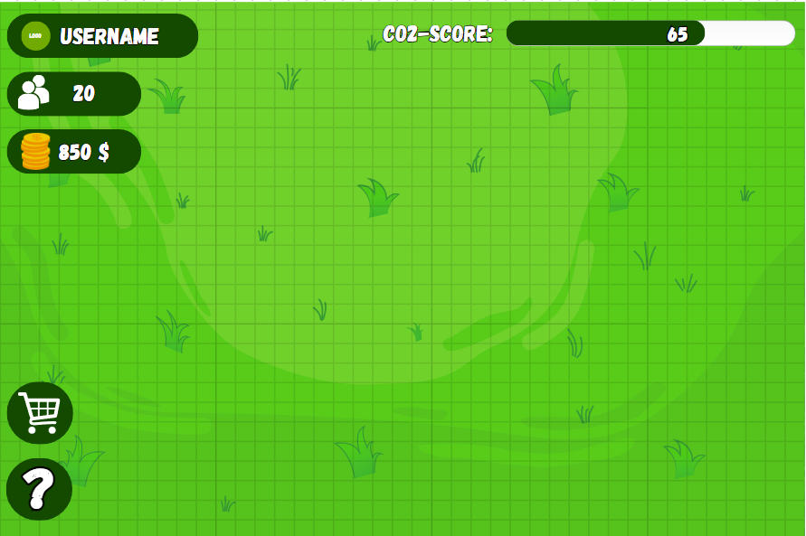

# Main game screen

## First game concept visual

Here you see a first simple concept of how the main screen will look like. All the parts are explained below.

## Game flow, target, end, ...

- What kind of game is this?
    This is, in fact, a city-builder game where the player buys items in the shop with in-game coins. The more houses and places there are, the more people live in the city. Coins can be earned by having houses, etc., in the city. Occasionally, a main character gives the player trivia about the climate, depending on the decisions the player made.

- The game has a few elements that depend on whether the player is playing well or poorly:
    1. **Eco-score**: This is the main element that can go lower or higher depending on the decisions the player makes. For example, if there aren't many trees in the city, the score goes lower. When this score reaches 0, the game is over. It is displayed on a progress bar in the upper right corner.
    2. **Coins**: These can be earned and are used to buy assets in the shop. The amount of coins the player earns depends on the number of people in the city. Coins are auto-collected.
    3. **People**: To have more people, the player has to build more houses. More people result in more coins. People may move away if the eco-score lowers too much, triggering a notification on the screen.

## Shop and assets

When clicking the shop button, the shop appears at the bottom of the screen, first showing the categories.

When a category is clicked, the category icon and name move to the left side, and all the assets from that category are shown (icons and prices).

When the player selects an item from the shop, all the other elements (coins, score, etc.) disappear until a place for the object is chosen on the grid. After that, they reappear, but if the placed item occupies the same place as an element, the element is placed above the item. This design choice allows for a larger grid to place assets.

All the assets are visualized in the table below:

| Category         | Asset                        | Price | Eco-Score Effect                               |
|------------------|------------------------------|-------|-------------------------------------------------|
| Buildings        | House                        | $1000 | tbd                                             |
| Buildings        | Store                        | $3000 | tbd                                             |
| Special          | Hospital                     | $15000| tbd                                             |
| Nature           | Tree/park                    | $250  | tbd                                             |
| Energy           | Windmill                     | $2000 | tbd                                             |
| Energy           | Factory                      | $10000| tbd                                             |

## Info-button

The info button (the button with the question mark) shows a popup on the screen when clicked. It briefly explains what the three elements do (eco-score, people, and coins) and the main goal of the game.

## Game start

- Coins at start: $1000.
- People at start: 0.
- Eco-score at start: 50.
- Happiness at start: 50.
- Date stars at: 01-01-2022
- The game starts with an empty grid.

## Climate trivia

All trivia about climate that is shown during gameplay is listed below, along with the occasions when they can show up:

| Trivia                                                                                  | Occasion                            |
|-----------------------------------------------------------------------------------------|-------------------------------------|
| Did you know? Trees absorb carbon dioxide and release oxygen, helping to clean the air we breathe. | Random event during gameplay       |
| Fun Fact: Solar panels convert sunlight into electricity without producing harmful emissions. | After the player constructs a Solar Panel |
| Fact: Recycling one aluminum can saves enough energy to power a TV for three hours.       | After the player builds a Recycling Center |
| Interesting Fact: Rainforests are home to over half of the world's plant and animal species, despite covering only 6% of Earth's land surface. | When the player buys a nature object in the shop |
| Environmental Tip: Turning off lights and unplugging electronics when not in use can help conserve energy and reduce electricity consumption. | Random event during gameplay       |
| Fun Fact: Bees play a crucial role in pollinating many of the fruits and vegetables we eat, contributing to food production and biodiversity. | After the player constructs a Garden or Park |
| Fact: The ozone layer in Earth's atmosphere protects life on the planet by absorbing harmful ultraviolet radiation from the sun. | Random event during gameplay       |
| Did you know? Hybrid and electric vehicles produce fewer greenhouse gas emissions than traditional gasoline-powered cars. | After the player constructs an Electric Vehicle Charging Station |
| Interesting Fact: Rainwater harvesting involves collecting and storing rainwater for later use in irrigation, landscaping, and household activities. | When the player unlocks the Nature Objects category in the shop |
| Environmental Tip: Choosing products with minimal packaging and opting for reusable items can help reduce waste and conserve resources. | Random event during gameplay       |
| More trivia yet to be added                                                             | TODO                                |

## Additional functionality (todo)
- Adding hotels, appartments and skyscraper buildings
- Behind the fixed UI elements you shouldn't be able to build
- Adding max upgrades for all assets
- Creating different houses (randomly chosen or choose in shop under house tab) 
- House happiness? (in progress --> Esteban)
- In shop add the prefab stats on mouseover
- Dead end streat should stop
- For prefabs at the bottom, show upgrade menu at the top (same for left and right)
- If you delete a road, update adjacent roads again
- Auto save?
- Prefab mountain, river, ... on map?
- GAME IS TOO EASY
- Effective range for buildings (where do they affect the happines?)(in progress --> Esteban)
- (If you place multiple parks besides eachother, you create one big park)
- Statues (very expensive)
- Trivia RESIZE!
- .exe on website
